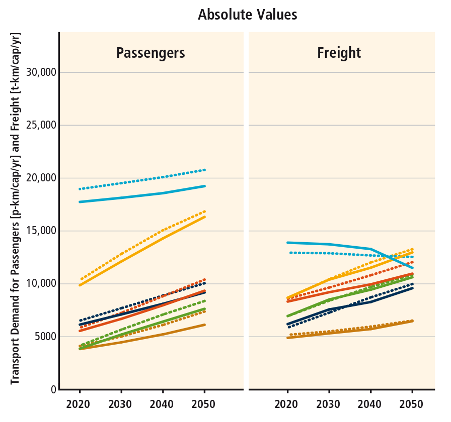

```{r setup, include=FALSE}
options(htmltools.dir.version = FALSE)
```

# whoami

.pull-left[
- Environmental geographer

- Learned R for PhD on energy and transport

- Now work at the University of Leeds (ITS and LIDA)

- Working on Geocomputation with R

```{r, eval=FALSE}
devtools::install_github("r-rust/gifski")
system("youtube-dl https://youtu.be/CzxeJlgePV4 -o v.mp4")
system("ffmpeg -i v.mp4 -t 00:00:03 -c copy out.mp4")
system("ffmpeg -i out.mp4 frame%04d.png ")
f = list.files(pattern = "frame")
gifski::gifski(f, gif_file = "g.gif", width = 200, height = 200)
```

]

--

.pull-right[
Image credit: Jeroen Ooms + others

```{r, out.width="100%"}
knitr::include_graphics("https://user-images.githubusercontent.com/1825120/39661313-534efd66-5047-11e8-8d99-a5597fe160ff.gif")
```

]

---
class: inverse, center, middle

# The problem

---
background-image: url(https://pbs.twimg.com/media/DOH94nXUIAAgcll.jpg)
background-position: 50% 50%
class: center, bottom, inverse

# Cities look a bit like this

---

# Transport: growing source of emissions

.pull-left[

```{r}

```

]

--

.pull-right[

- People like to travel!

- Does not 'saturate' with income

- Hard to decarbonise via technology


]

---
class: inverse, center, middle

# Solutions

---

# Make cycling the natural choice

```{r, echo=FALSE, out.width="70%"}
knitr::include_graphics("https://pbs.twimg.com/media/DJaWCo0U8AAzQGW.jpg:large")
```

Source: [Brent Toderian](https://twitter.com/BrentToderian)

--

## For everyone: a political problem

---

# Another problem...

```{r, echo=FALSE, out.width="80%"}
knitr::include_graphics("https://larrycuban.files.wordpress.com/2015/02/data-overload-2.jpg")
```

--

## Data overload

<!-- Source: [Larry Cuban](https://larrycuban.files.wordpress.com/2015/02/data-overload-2.jpg) -->

---
class: inverse, center, middle

# Technical solutions

---

# Simplify the data deluge

Cycling network in Seville: 'basic' (77 km) and ‘complementary’ (120 km, dashed line) cycleways (from Marqués et al. 2015). Led to fourfold increase in cycling. 

```{r, echo=FALSE}
knitr::include_graphics("https://raw.githubusercontent.com/ATFutures/who/master/fig/sevnet2.png")
```

---

## Estimate cycling pontential: the Propensity to Cycle Tool - see [w](http://npct0.vs.mythic-beasts.com/shiny_interface/?r=west-yorkshire)[ww.pct.bike](www.pct.bike)

Included in UK policy (CWIS) used by many local authorities (LCWIP)

```{r, echo=FALSE, out.width="80%"}
knitr::include_graphics("https://raw.githubusercontent.com/npct/pct-team/master/figures/front-page-leeds-pct-demo.png")
```

---

# Build infrastructure

- Link between infrastructure and uptake between 2001 and 2011 in English regions
- But how to ensure that infrastructure is effective?

```{r, echo=FALSE, out.width="80%"}
knitr::include_graphics("https://raw.githubusercontent.com/cyipt/cyipt-website/master/images/ttwa-uptake.png")
```

---

# Identify cost-effective schemes: the CyIPT

- A ~~publicly available~~ password protected web app providing accessible evidence on cycling infrastructure hosted at [www.cyipt.bike](https://www.cyipt.bike/)

```{r, echo=FALSE}
knitr::include_graphics("https://www.cyipt.bike/images/home-example.png")
```

---
class: inverse, center, middle

# How R can help

---

# Scalability

```{r, tidy=FALSE, message=FALSE, echo=FALSE}
d = readr::read_csv("https://github.com/npct/pct-team/raw/master/data-sources/cycle-tools.csv")
DT::datatable(
  d,
  fillContainer = FALSE, options = list(pageLength = 8)
)
```

---

# Visualisation

- Live demo...

```{r, eval=FALSE}
# try it!
shiny::runGitHub("robinlovelace/erum18-transport")
```

---

# Some example shiny code

```{r, eval=FALSE}
# non-reproducible snippet
getroads = reactive({                 
  roads[roads$highway == input$type, ]
})
renderLeaflet({
  m = tm_shape(getroads()) +
    tm_lines(col = "red", lwd = 5) +
  tmap_leaflet(m) # you can use tmap in shiny!
})
```

---

# Local routing

```{r, eval="`r if(nchar(sys.getenv) == 32)`"}
fr = stplanr::geo_code("Budapest airport")
to = stplanr::geo_code("akvarium budapest")
r = cyclestreets::journey(fr, to)
mapview::mapview(r)
```


---

class: center, middle

# Thanks and safe 🚶, 🚲 +  🚀!

Slid--

- Reproducible slides + app: [github.com/Robinlovelace/erum18-transport](https://github.com/Robinlovelace/erum18-transport)

es created via the R package [**xaringan**](https://github.com/yihui/xaringan).

---
class:small

Test
